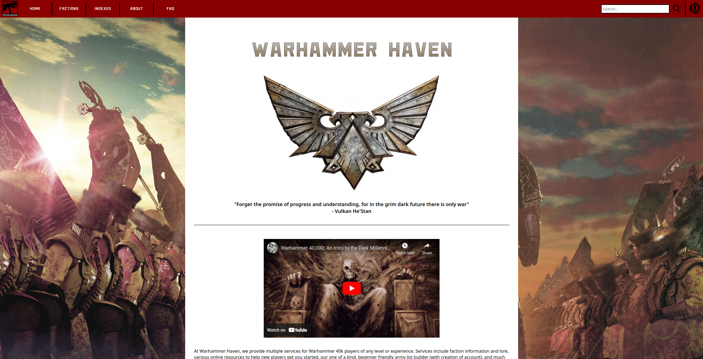

# Warhammer Haven Website


## Project Setup Prelude
This project assumes you have a basic understanding on how to use XAMPP and PHPMyAdmin. In order to get this project working, you need to install XAMPP. If you don't know how to install XAMPP, find a guide on the internet for your operating system. Once, XAMPP is installed proceed to the next section.

## IMPORTANT
**If you change this project's folder name at all (from Warhammer-Demo-Website to <insert_name_here>), you MUST update the PROJECT_WORKSPACE constant to the new folder name which is located at `utils/constants.php`**

## Making the Website Accessible by XAMPP (Required)
* You have two main options when helping XAMPP find this website. Options 1 or 2.
    * Moving the project folder to `<XAMPP_install_path>/XAMPP/htdocs/Warhammer-Demo-Website` 
    * Creating a soft link at `<XAMPP_install_path>/XAMPP/htdocs/super_cool_soft_link` and having this project folder be installed most anywhere on your system.
* Here in an example command for UNIX-based operating systems for soft-link creation. 
    * `ln -s <this_project_path>/Warhammer-Demo-Website <XAMPP_install_path>/XAMPP/htdocs/<your_soft_link_name>`. 
    * By doing this, you can navigate to the website by using the soft link name. e.g. `localhost/<your_soft_link_name>`.

Note. Please ensure XAMPP has permissions to access this project's directory. Otherwise, you won't be able to run the website.

## PHPMyAdmin Database Creation (Required)
Ensure that within the XAMPP Control Panel, you start the processes "Apache" and "MySQL". You can test if these are running by using a web browser and navigating to "localhost". If you get an XAMPP-related welcome screen, you are good to go. It's time to create the database that this website will use. Inside the root directory, there is an initialization script for the database. To call this script, you need to navigate to the file in the web browser

* `localhost/<project_path>/cs268group10databasesetup.php`

Whatever you choose, if you set everything up correctly, you should get a screen that tells you all the database and tables were created successfully. Once that is done, the website is now full operational, you can navigate to the to the root directory and use the website.

## PHPMyAdmin Account Creation (Optional)
By default, this project will log into PHPMyAdmin using the root account. If you would prefer to log into PHPMyAdmin using your own account, read further. Using PHPMyAdmin, create a user account. This user account should have a "host name" of "localhost". The username and password for this account can be whatever you wish. You'll need to remember your username and password for later when you place those values into a specific config file for the project (we'll do that later).  This account should
also have "all privileges" available to it. 

## Project "secrets.php" Creation (Conditional)
This step is only needed if you want to use your own user account for PHPMyAdmin. Otherwise, the default root account will be used. From the project root, you'll need to create a folder titled "secrets" and a file within that folder called "secrets.php". The folder structure from the project root should look like CS268GroupProjectGroup10/secrets/secrets.php . Within the secrets.php file, you'll need to copy/paste the contents below and set the PHP variables to be your personal information from earlier.
```
<?php
// The name of the server. Probably localhost.
$db_server = "localhost";
// The username for the server
$db_username = "CS268Tyler";
// The password for the server
$db_password = "12345";
// The specific database within that server to use
$db_name = "cs268group10database";
?>
```
Once the secrets.php file has been created and you placed your relevant data into it, proceed to the next section.


## Copyright
All content, trademarks, and copyrights are the property of their respective owners. This includes, but is not limited to, Warhammer and its associated materials. No infringement is intended. This was a class project indended for educational purposes.